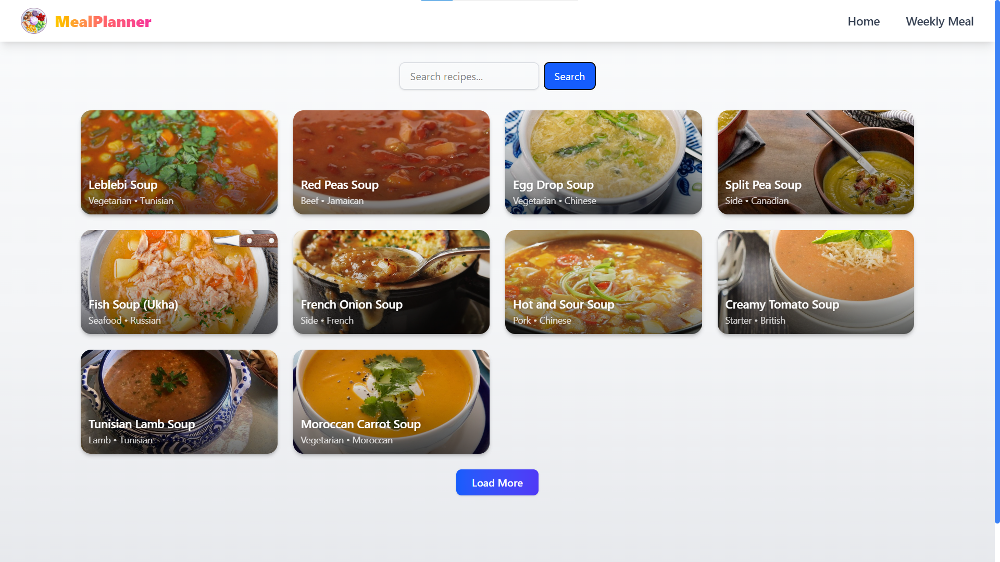
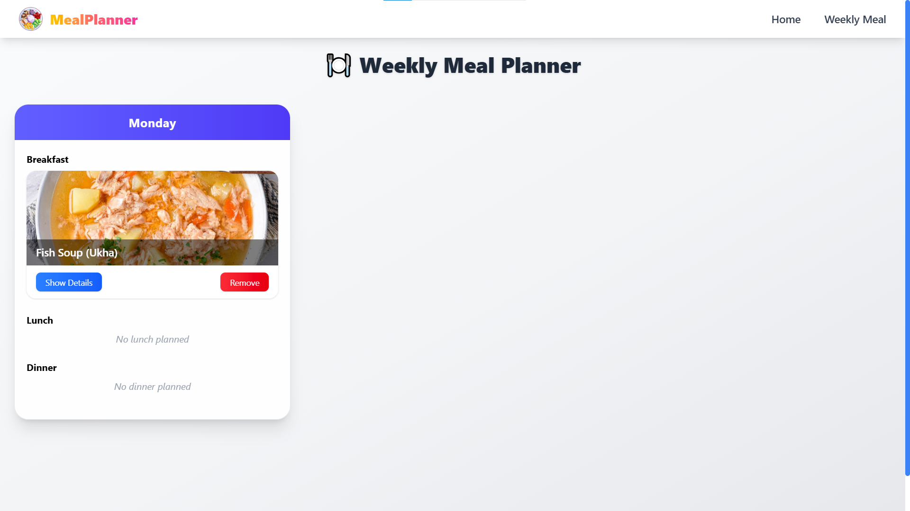
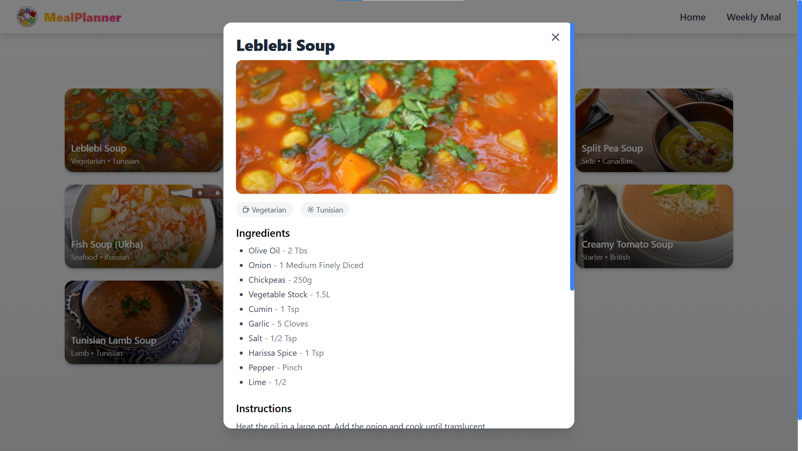

# MealPlanner 🍽️

MealPlanner is a modern web application to **discover, save, and plan weekly meals**. Users can search for recipes, view details, and organize their weekly meal plan. Built with **React**, **TypeScript**, and **TailwindCSS**.

---

---

## Features

- Search recipes using keywords.
- View recipe **details**, ingredients, and instructions.
- Add recipes to a **weekly meal planner**.
- Remove or **replace meals** in the planner.
- Responsive UI with **TailwindCSS** and subtle animations.
- Modern homepage with **welcome screen and tips**.
- Navigation with **Navbar** component.

---

## Libraries Used

- **React** - Frontend library.
- **TypeScript** - Type safety.
- **React Router** - Page navigation.
- **TailwindCSS** - Styling.
- **Lucide-react** - Modern icons.
- **React Context** - Global state for meal plan.
- **Fetch API** - To get recipe data.

---

## API Used

- **TheMealDB API**  
  Base URL: `https://www.themealdb.com/api/json/v1/1`

## Folder Structure

Recipe-Finder/
│
├── public/
│ └── index.html
│
├── src/
│ ├── assets/ # Images, logos, icons
│ ├── components/ # Reusable UI components
│ │ ├── common/ # Loader, ErrorMessage, etc.
│ │ ├── Navbar.tsx
│ │ ├── RecipeCard.tsx
│ │ ├── RecipeModal.tsx
│ │ ├── DayCard.tsx
│ │ ├── SearchBar.tsx
│ │ └── MealPlanner.tsx
│ │
│ ├── context/ # React context for global state
│ │ └── MealPlanContext.tsx
│ │
│ ├── hooks/ # Custom hooks
│ │ └── useFetchRecipe.ts
│ │
│ ├── pages/ # Page components (if needed)
│ │ └── Home.tsx
│ │
│ ├── App.tsx # Main app component
│ ├── main.tsx # Entry point
│ └── index.css # Tailwind base styles
│
├── package.json
├── tsconfig.json
└── README.md

[🌐 Live Demo](https://meal-planner-weekly.netlify.app/)